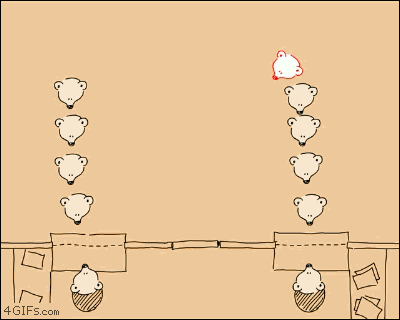

# Exercise 4.2 - 🚏 Queue Array

## 🎯 Objectives
Implement an array-based queue data structure in python..

## 🔍 Context
Use the description of the "Flat Array " implementation of a queue to design your code.

## 🚦 Let's Go
Let's set this up:

1. Create a class called `IntQueue`.
2. Add the necessary fields to store queue.
3. Create one constructors where the default `capacity` is set to `QUEUE_CAPACITY`.
4. Implement the methods of the `Queue` API: `enqueue(..)`, `dequeue()`, `front()`, `is_empty()` and `is_full()`.
5. Raise the exceptions `QueueOverflowError` and `QueueUnderflowError` when the caller has not met the operation preconditions.

