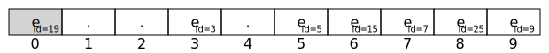

# Sets

> The defining feature of sets is that its elements are UNIQUE.

In mathematics, a set is defined as **a collection of distinct, well-defined objects forming a group**. There can be any number of items, be it a collection of whole numbers, months of a year, types of birds, and so on. Each item in the set is known as an element of the set.

In other words a *set* is a collection of **distinct** elements.

```text
{2, 3, 5, 7} 
{'a', 'b', 'c'} 
{"aardvark", "aardwolf", "albatross"}
```

## Sets in Computer Science

In computer program, sets are represented by a collection of elements.   For each `element`, there must be some identifying feature that distinguishes one `element` from another, which ensures that each element in the set is *unique*.

In this discussion, the elements in our sets will be `objects` that have a property `id` which is unique to each object.

### Operations

#### Contains

The fundamental operation *contains* (a.k.a.: member, usually denoted by $\in$) on a set is to tell
if an element is contained within it:

$$
a \in {a, b, c}
c \not\in {a, b}
$$

#### Contains all

Determine if every element of a set $A$ is also in a second set $B$, that is, $A$ is entirely in $B$
(a.k.a. subset). This is usually written as $A \subseteq B$. For example:

$$
\{a, c\} \subseteq \{a, b, c, d\}  \hspace{1cm}  \{b, d\} \not\subseteq \{a, b, c\}
$$

A more formal definition of subset is: 

​	for all $x$, if $x \in A$ then $x \in B$.

#### Add

Sets are built using an operation for adding an element to an existing set. If we have a set
$\{a,b\}$, then $\textbf{add}(c)$ would yield $\{a,b,c\}$. Add should behave like the traditional
set *union* operation $\cup$, in that adding a duplicate to a set would leave the set unchanged. Ex:

$$
\{a,b,c\} \cup \{d\}  = \{a,b,c,d\} \hspace{1cm} \{a,b,c\} \cup \{b\} = \{a,b,c\}
$$

#### Remove

An element can be removed from a sorted set using the remove operation. If we have a set
$\{a,b,c\}$, then $\textbf{remove}(c)$ would yield $\{a, b\}$. Remove should behave like the
traditional set *difference* operation $-$, in that removing an element not in the original set
results in the set unchanged. Ex:

$$
\{ a, b, c \} - \{ d \} = \{ a, b, c \} \hspace{1cm} \{ a, b, c \} - \{ b \} = \{ a, c \}
$$

#### Size

Number of elements of the set (a.k.a. cardinality). This is usually written as $|A|$.

$$
A= \{ a, b, c \} \hspace{1cm} |A| = 3
$$

#### Empty

Determine if the set is empty ($\{\}$) or full. 

### Set API ###

This specification uses a type parameter `T`.


| `contains`   |                                                                                                                       |
|--------------|-----------------------------------------------------------------------------------------------------------------------|
| Description  | Determine if the set contains a specific element.                                                                     |
| Signature    | `__contains__(element: T) -> bool`                                                                                    |
| Precondition | There must be an agreed upon method to determine the uniqueness of each element.                                      |
| Mutator      | No.                                                                                                                   |
| Returns      | If the element is found in the set that equals `element`, then returns `True`, otherwise, the method returns `False`. |

| `contains_all` |                                                                                                                                     |
|----------------|-------------------------------------------------------------------------------------------------------------------------------------|
| Description    | Determine if the set contains all the elements of the provided set, or, that the provided set is a subset of the current set.       |
| Signature      | `contains_all(other: Set[T]) -> bool`                                                                                               |
| Precondition   | There must be an agreed upon method to determine the uniqueness of each element.                                                    |
| Mutator        | No.                                                                                                                                 |
| Returns        | Returns `True` if all the elements of `rhs` are in the current set, `False` otherwise. If the provided set is empty, return `True`. |

| `add`        |                                                                                                                                                                  |
|--------------|------------------------------------------------------------------------------------------------------------------------------------------------------------------|
| Description  | Add an element into the set. If there is no element in the set that equals `element`, then the element is inserted into the set, otherwise the set is unchanged. |
| Signature    | `add(element: T) -> bool`                                                                                                                                       |
| Precondition | There must be an agreed upon method to determine the uniqueness of each element.                                                                                 |
| Mutator      | Yes.                                                                                                                                                             |
| Returns      | The method returns `True` if the element is added to the set, and `False` otherwise.                                                                             |
|              |                                                                                                                                                                  |

| `remove`     |                                                                                                                                                           |
|--------------|-----------------------------------------------------------------------------------------------------------------------------------------------------------|
| Description  | Remove an element from the set. If there is an element in the set equal to `element`, then it is removed from the set. Otherwise, a `KeyError` is raised. |
| Signature    | `remove(element: T)`                                                                                                                                      |
| Precondition | There must be an agreed upon method to determine the uniqueness of each element.                                                                          |
| Mutator      | No.                                                                                                                                                       |
| Returns      | None.                                                                                                                                                     |

| `length`     |                                              |
|--------------|----------------------------------------------|
| Description  | Determine the number of elements in the set. |
| Signature    | `__len__() -> int`                           |
| Precondition | None.                                        |
| Mutator      | No.                                          |
| Returns      | Returns the number of elements in the set.   |

| `is_empty`   |                                                        |
| ------------ | ------------------------------------------------------ |
| Description  | Determine if the set is empty.                         |
| Signature    | `is_empty() -> bool`                                   |
| Precondition | None.                                                  |
| Mutator      | No.                                                    |
| Returns      | Returns `True` if the set is empty, `False` otherwise. |

| `is_full`    |                                                                                          |
|--------------|------------------------------------------------------------------------------------------|
| Description  | Determines if the set is full (i.e. there is no more space to store additional elements) |
| Signature    | `is_full() -> bool`                                                                      |
| Precondition | None.                                                                                    |
| Mutator      | No.                                                                                      |
| Returns      | Returns `True` if the set is full, `False` otherwise.                                    |

| `__str__()`    |                                                                        |
|----------------|------------------------------------------------------------------------|
| Signature      | `__str__()`                                                            |
| Description    | Get a string representation of the set.                                |
| Pre-conditions | None.                                                                  |
| Returns        | Returns a string representation of the set, consisting of:             |
|                | -   a `{`,                                                             |
|                | -   the string representations of the elements, comma-separated, and |
|                | -   a `}`.                                                             |

# An Array Implementation of Set

## Uniqueness

There must be an agreed upon method to determine the uniqueness of each element.  For the examples shown below, we will limit the type of elements we can store in our set to only those with integer IDs, which
we'll call *identifiable*. We can enforce this restriction only allowing elements whose class
implements an interface called `Identifiable`:


```python
from typing import Protocol

class Identifiable(Protocol):
    id: int

```

Each identifiable object has a method called `id()` that, when implemented correctly, will give a unique integer for that object. 

## Storing the Elements in an Array

### Efficiency

Because sets require that each element is unique to every other element, there is a fair amount of effort looking up elements in the array to verify that they are not the same as any element that we want to add.

So, storing the elements as a `stack` or `queue` would be *very* inefficient.

### Use IDs as Array Indices 

For example let's store a set containing elements $e_{\mathsf{id}=3}$, $e_{\mathsf{id}=4}$, $e_{\mathsf{id}=5}$ and $e_{\mathsf{id}=8}$ like this:


But, since IDs are arbitrary integers, they can be large and very far from each other in the array. (*Think about your student IDs!*)


This would be a HUGE waste of space.

#### Saving Space using Modulus

We can "squeeze" any ID into an array position by applying the modulus operator: 

`pos = id % elements.length`

For example if we have a set containing elements $e_{\mathsf{id}=12343}$, $e_{\mathsf{id}=11314}$, $e_{\mathsf{id}=13345}$ and $e_{\mathsf{id}=12128}$ and an array size of $10$:


#### Collisions

Unfortunately, it is possible that two elements will have the same location within the range of indices `[0, elements.length - 1]`. When this happens we call it a *collision*. 

We will handle collisions in the following way: consider the array a "circular" array, 

* proceed clockwise (increasing index) until you find an empty cell, and place the element in that cell.

Example 1: If we have the set:


and we add $e_{\mathsf{id}=15}$, we will get a collision in cell 5, so this new element will end up
in cell 6:


and then if we add $e_{\mathsf{id}=25}$, we will get a collision in cells 5, 6 and 7, so it will end
up in cell 8:


Example 2: A collision can happen at the end of the array. Again, if we add element $e_{\mathsf{id}=19}$, we "wrap" around and place it at the beginning of the array:




## Removing elements

Removing elements is now a bit more complicated. Removing elements will produce "holes" that will
break your other set methods, like `contains()`, unless we're careful.

For example, if we have:


and remove $e_{\mathsf{id}=15}$ by making it empty again:


Finding $e_{\mathsf{id}=25}$ won't work anymore!

We will solve this problem by adding *tombstones* for removed elements.
A tombstone will be left in cells where element has been removed:


When searching for an element, tombstones should be passed over to find elements on the other side!

Tombstones might eventually be replaced when adding a new element to the
set. For example, in the previous set, if we add the element
$e_{\mathsf{id}=35}$, then the tombstone will be filled:


## Cleaning up!

Eventually, if we have lots of tombstones, they will be in the way when
searching for elements. Implement a method called `clean()` that will
simplify the space by removing all tombstones.

For example, cleaning the tombstones from:


will result in:


# Starter and Unit tests

Use the provided starter to implement the class `IdSet[S]` as it is set up. It uses the class
`Cell[T]` and the enum `State` to store information about the contents of the array.

The unit tests in `test_id_set.py` are provided to check your progress, but does not guarantee that your
implementation is entirely correct.

## Restrictions:

* Elements must be stored in an array using `our_array.py`, not a list or any other data structure
  (It's a learning process :) ).
 
## Marking Criteria

### Code Quality
*    Type hinting is an ABSOLUTE requirement!
*    Decent comments
*    Function documentation
*    Follow the guidelines in the student notes [GuideLines](https://jac-cs-programming-4-w24.github.io/Notes/#/GuideLines)

### Functionality
*    ID-set operations must work as described here.


# Submission 

On LEA, submit a `.txt` file with the commit ID of your submission.`


